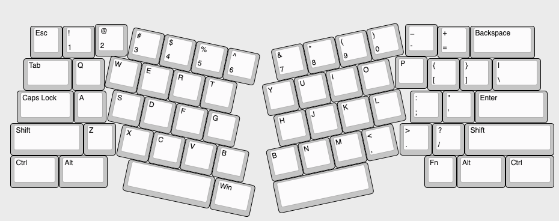
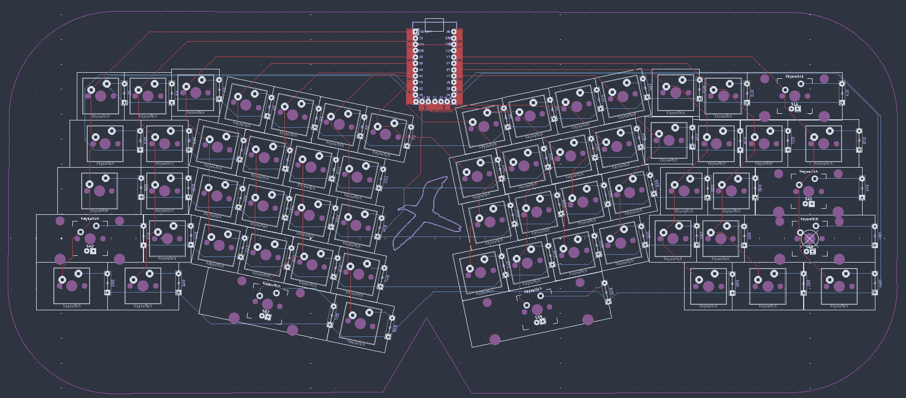
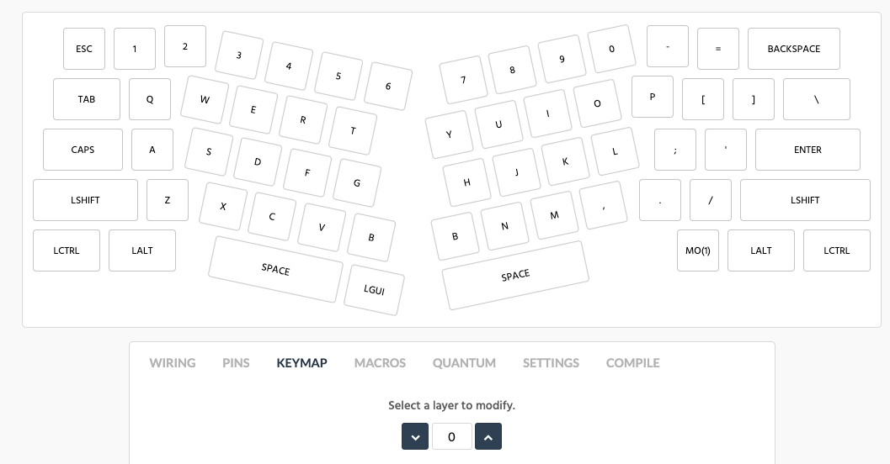
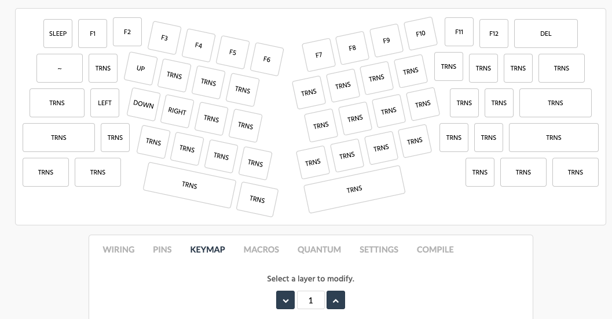
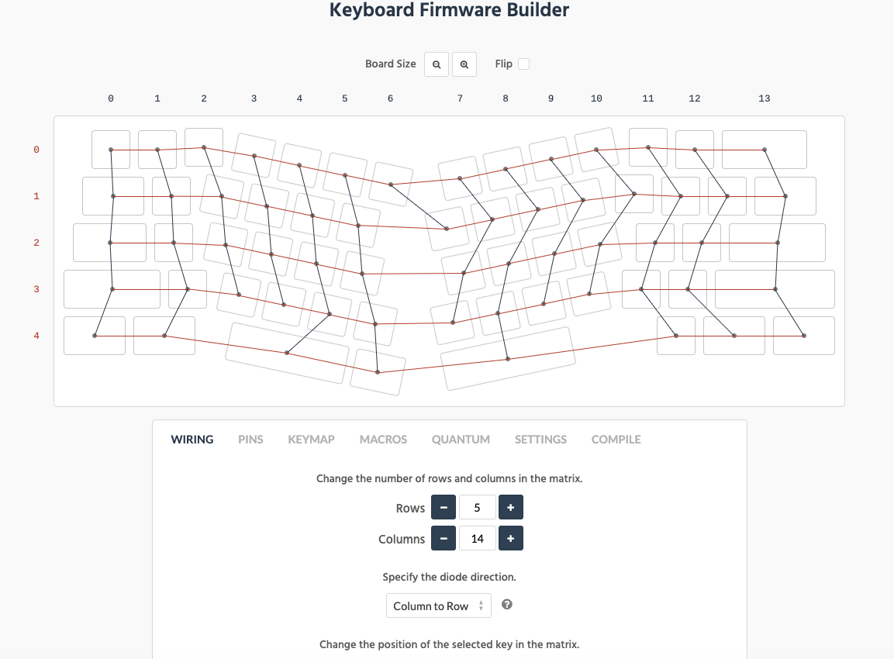
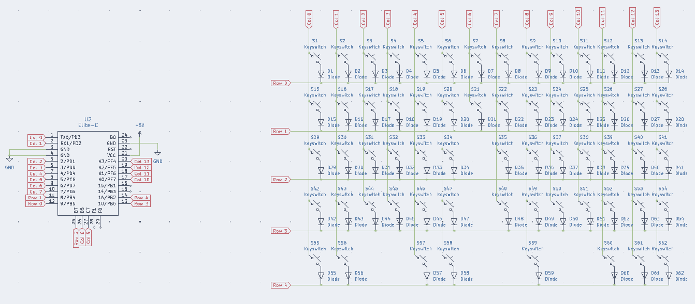

# Albatross

The Albatross is a modified version of the Alice layout. This is a split-fixed, 62-key, staggered keyboard. The current version does **not** have - hotswap, backlight (of any kind), and wireless capabilities.

## Layout

## Process

### PCB Design

This was my first time designing a PCB! I made a 2-layer PCB with rows routed in the front layer and columns in the back layer. This keyboard uses the Elite-C microcontroller.

### Keymap

#### Layer 1

#### Layer 2

### Wiring

### Schematic

### Aesthetic Choices

The Albatross is a unique bird. One of its skills, called dynamic soaring, is a zero-energy flight technique, which seems nothing short of intuitive to the naive tubenose; it allows the bird to fly thousands of miles without flapping its wings. Like the Albatross, we rely on intuition while doing our chores or completing any simple or complex daily task. With technology at the forefront of almost every industry, we rely on computers for assistance with our chores. Technology and its applications are seen as carefully crafted experiences incorporating human psychology with design principles in a little package delivered to us as a product. As a technologist, one of my primary goals is to make information systems accessible and usable for everyone. Keeping up with this mission, I designed this modified version of the Alice layout — the Albatross.

The cut at the bottom of the case and PCB has an upward arrow highlighting the albatross’s soaring techniques. The case is made from a clear 1.5mm acrylic sheet — staying true to the idea of transparency and usability — the case is see-through, and everyone can see the inner workings of the board easily. The botanical keycaps represent flora; paired with the albatross outline on the silkscreen of the PCB, which represents fauna, we get a 360 picture of nature. The switches are silent and linear; the keyboard allows you to immerse yourself in the sounds of your surroundings without the distraction of clattering keys.

### Acknowledgements

This keyboard's assembly and PCB design would have been impossible without the support and help of many folks, especially Joey Castillo. Huge shoutout – thanks, Joey!

### Future Work
Using a thin material like 1.5mm acrylic for the keyboard proved beneficial for aesthetics and acoustics but required careful handling due to its fragility, as a small crack occurred during assembly. Planned improvements for the next iteration include adjusting the spacing between the “>” and “:” keys for better usability, adding a silkscreen design to the top layer for enhanced aesthetics, and designing a cover with an integrated wrist rest for improved ergonomics. Additionally, since this is a sensory-friendly board, creating a cover to hide the bright blue light from the Elite-C microcontroller is a priority. Exploring a switch to a BLE-supported microcontroller paired with a long-lasting battery is also under consideration. Further plans involve testing more variations of ergonomic layouts and experimenting with different case angles to optimize comfort and functionality.
